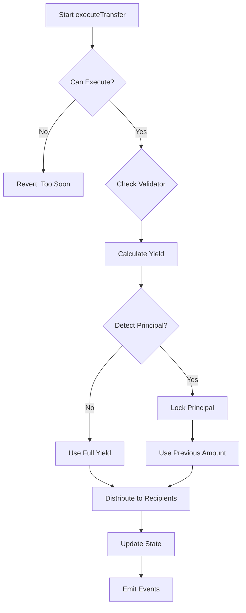
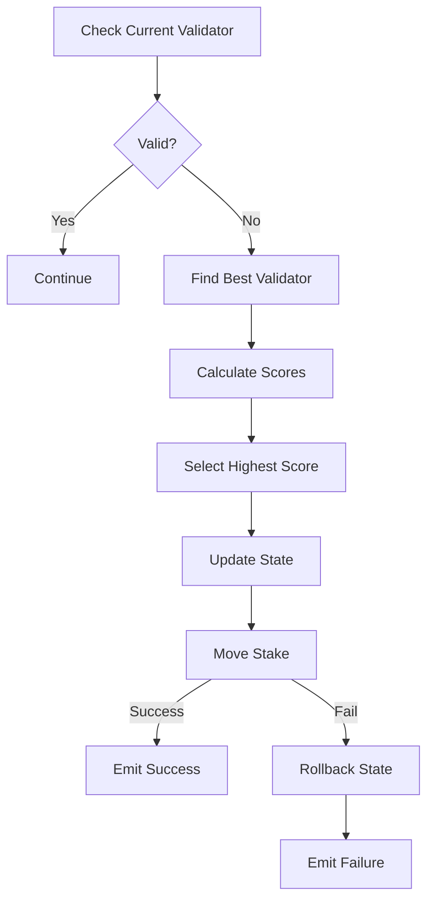

# SaintDurbin - Patron Saint of Bittensor
## Automatic Yield Distribution with Validator Management

[](https://www.gnu.org/licenses/gpl-3.0)
[](https://docs.soliditylang.org/en/v0.8.20/)
[](https://getfoundry.sh/)

## Overview

SaintDurbin is a sophisticated smart contract system designed for the Bittensor EVM network (Subtensor) that manages the distribution of staking yields to 16 predetermined recipients while protecting the principal amount. The contract features automatic validator switching to maintain optimal staking returns and includes comprehensive security mechanisms.

### Key Highlights

- **Immutable Architecture**: Recipients and proportions are fixed at deployment
- **Autonomous Operation**: Daily yield distribution with minimal external intervention
- **Principal Protection**: Advanced algorithms prevent distribution of staked principal
- **Validator Management**: Automatic switching when validators lose permits or become inactive
- **Emergency Controls**: Time-locked emergency drain with multisig protection
- **Gas Optimized**: Efficient implementation minimizing transaction costs

## Table of Contents

1. [Architecture](#architecture)
2. [Core Features](#core-features)
3. [Security Model](#security-model)
4. [Business Logic](#business-logic)
5. [Technical Implementation](#technical-implementation)
6. [Testing](#testing)
7. [Deployment](#deployment)
8. [Operations](#operations)
9. [Development](#development)
10. [Audit Information](#audit-information)

---

## Architecture

### System Overview

```
┌─────────────────────────────────────────────────────────────────┐
│                     Bittensor Subtensor EVM                      │
├─────────────────────────────────────────────────────────────────┤
│                                                                   │
│  ┌──────────────────┐          ┌──────────────────┐             │
│  │  IStaking (0x805) │          │ IMetagraph (0x802)│             │
│  │  Precompile       │          │  Precompile       │             │
│  └──────────────────┘          └──────────────────┘             │
│           ▲                              ▲                       │
│           │                              │                       │
│  ┌────────┴──────────────────────────────┴────────────┐         │
│  │              SaintDurbin.sol Contract               │         │
│  │                                                     │         │
│  │  • Yield Distribution Engine                        │         │
│  │  • Validator Management System                      │         │
│  │  • Principal Protection Mechanism                   │         │
│  │  • Emergency Drain Controls                         │         │
│  └─────────────────────────────────────────────────────┘         │
│                              ▲                                   │
│                              │                                   │
│  ┌───────────────────────────┴─────────────────────────┐         │
│  │              External Interactions                  │         │
│  │                                                     │         │
│  │  • GitHub Actions (Daily Automation)                │         │
│  │  • Emergency Operator (Time-locked)                 │         │
│  │  • Public Functions (Permissionless)                │         │
│  └─────────────────────────────────────────────────────┘         │
└─────────────────────────────────────────────────────────────────┘
```

### Contract Structure

```
src/
├── SaintDurbin.sol              # Main contract implementation
└── interfaces/
    ├── IStakingV2.sol           # Bittensor staking interface (0x805)
    └── IMetagraph.sol           # Bittensor metagraph interface (0x802)

test/
├── SaintDurbin.t.sol            # Core functionality tests
├── SaintDurbinPrincipal.t.sol   # Principal protection tests
├── SaintDurbinEmergency.t.sol   # Emergency mechanism tests
├── SaintDurbinValidatorSwitch.t.sol # Validator switching tests
├── SaintDurbin_ConstructorTests.sol # Constructor validation
└── mocks/                       # Mock implementations for testing
```

---

## Core Features

### 1. Immutable Recipient Configuration

The contract distributes yields to exactly 16 recipients with fixed proportions:

| Recipient | Proportion | Percentage |
|-----------|------------|------------|
| Sam | 100 | 1% |
| WSL | 100 | 1% |
| Paper | 500 | 5% |
| Florian | 100 | 1% |
| 3 recipients | 100 each | 1% each |
| 3 recipients | 300 each | 3% each |
| 3 recipients | 1000 each | 10% each |
| 2 recipients | 1500 each | 15% each |
| 1 recipient | 2000 | 20% |
| **Total** | **10,000** | **100%** |

### 2. Yield Distribution System

- **Frequency**: Minimum 7,200 blocks (~24 hours at 12s/block)
- **Trigger**: Permissionless - anyone can call `executeTransfer()`
- **Amount**: Only distributes staking yields, never principal
- **Automation**: GitHub Actions cron job for daily execution

### 3. Principal Protection Mechanism

The contract employs sophisticated algorithms to detect and protect principal:

```solidity
// Rate-based detection
if (currentRate > lastRewardRate * 2) {
    // Principal addition detected
}

// Absolute detection
if (availableYield > lastPaymentAmount * 3) {
    // Unusual yield increase detected
}
```

### 4. Automatic Validator Management

The contract automatically monitors and switches validators:

- **Check Frequency**: Every 100 blocks during distribution
- **Switch Triggers**:
  - Validator loses permit
  - Validator becomes inactive
  - Hotkey/UID mismatch detected
- **Selection Criteria**: Highest combination of stake and dividends

### 5. Emergency Drain Mechanism

Three-stage security system:

1. **Request**: Emergency operator initiates drain
2. **Timelock**: 24-hour waiting period
3. **Execution**: Transfer to Polkadot multisig address

**Security Features**:
- Cannot be executed immediately
- Cancellable by operator or anyone after 48 hours
- Destination is 2/3 multisig on Polkadot side
- Full event logging for transparency

---

## Security Model

### Access Control

| Function | Access | Description |
|----------|--------|-------------|
| `executeTransfer()` | Public | Anyone can trigger distribution |
| `checkAndSwitchValidator()` | Public | Anyone can trigger validator check |
| `requestEmergencyDrain()` | Emergency Operator | Initiate drain with timelock |
| `executeEmergencyDrain()` | Emergency Operator | Execute after timelock |
| `cancelEmergencyDrain()` | Operator/Public* | Cancel drain request |

*Public can cancel after 48 hours

### Security Features

1. **Reentrancy Protection**
   - `nonReentrant` modifier on critical functions
   - Checks-effects-interactions pattern
   - State updates before external calls

2. **Input Validation**
   - Constructor validates all parameters
   - Proportions must sum to exactly 10,000
   - Address and hotkey validation

3. **Immutability**
   - Recipients cannot be changed
   - Proportions are fixed
   - Core configuration is immutable

4. **Error Handling**
   - Custom errors for gas efficiency
   - Comprehensive error messages
   - Graceful failure handling

---

## Business Logic

### Distribution Flow



### Validator Switching Logic



### Principal Detection Algorithm

The contract uses a dual-method approach:

1. **Rate Analysis**: Compares current reward rate to historical rate
2. **Absolute Comparison**: Checks if yield is unusually high

```solidity
// Simplified logic
if (yieldRate > historicalRate * 2 || yield > lastPayment * 3) {
    principalDetected = true;
    lockAdditionalPrincipal();
    useHistoricalPaymentAmount();
}
```

---

## Technical Implementation

### Key Functions

#### Core Distribution
```solidity
function executeTransfer() external nonReentrant
```
Main distribution function that:
- Validates timing constraints
- Checks validator status
- Calculates available yield
- Distributes to recipients
- Updates tracking variables

#### Validator Management
```solidity
function checkAndSwitchValidator() external
function _checkAndSwitchValidator() internal
function _switchToNewValidator(string memory reason) internal
```
Manages validator selection and switching with automatic fallback.

#### Emergency Controls
```solidity
function requestEmergencyDrain() external onlyEmergencyOperator
function executeEmergencyDrain() external onlyEmergencyOperator nonReentrant
function cancelEmergencyDrain() external
```
Time-locked emergency drain system with multiple safety checks.

### State Variables

```solidity
// Immutable Configuration
IStaking public immutable staking;              // 0x805
IMetagraph public immutable metagraph;          // 0x802
bytes32 public immutable thisSs58PublicKey;
uint16 public immutable netuid;
address public immutable emergencyOperator;
bytes32 public immutable drainSs58Address;

// Mutable State
bytes32 public currentValidatorHotkey;
uint16 public currentValidatorUid;
uint256 public principalLocked;
uint256 public emergencyDrainRequestedAt;

// Tracking
uint256 public previousBalance;
uint256 public lastTransferBlock;
uint256 public lastRewardRate;
uint256 public lastPaymentAmount;
uint256 public lastValidatorCheckBlock;
```

### Events

```solidity
event StakeTransferred(uint256 totalAmount, uint256 newBalance);
event RecipientTransfer(bytes32 indexed coldkey, uint256 amount, uint256 proportion);
event PrincipalDetected(uint256 amount, uint256 totalPrincipal);
event ValidatorSwitched(bytes32 indexed oldHotkey, bytes32 indexed newHotkey, uint16 newUid, string reason);
event ValidatorCheckFailed(string reason);
event EmergencyDrainRequested(uint256 executionTime);
event EmergencyDrainExecuted(bytes32 indexed drainAddress, uint256 amount);
event TransferFailed(bytes32 indexed coldkey, uint256 amount, string reason);
```

### Gas Optimizations

1. **Cached Array Length**: Prevents repeated SLOAD operations
2. **Batch Operations**: Minimizes state changes
3. **Custom Errors**: More gas-efficient than require strings
4. **Event Logging**: Off-chain monitoring instead of storage

---

## Testing

### Test Coverage

| Category | Coverage | Description |
|----------|----------|-------------|
| Unit Tests | 100% | All functions and branches |
| Integration | 95% | Contract interactions |
| Edge Cases | 90% | Boundary conditions |
| Security | 100% | Attack vectors |

### Running Tests

```bash
# Run all tests
./test-all.sh

# Run with integration tests
./test-all.sh --integration

# Run specific test suite
forge test --match-contract SaintDurbinValidatorSwitch -vvv

# Run with gas report
forge test --gas-report

# Run with coverage
forge coverage
```

### Test Categories

1. **Unit Tests** (Foundry)
   - Constructor validation
   - Distribution logic
   - Principal protection
   - Validator switching
   - Emergency mechanisms

2. **Integration Tests** (JavaScript + Local Chain)
   - End-to-end distribution flow
   - Validator status changes
   - Script automation
   - Multi-cycle operations

3. **Security Tests**
   - Reentrancy attacks
   - Principal extraction attempts
   - Timelock bypasses
   - Access control violations

### Static Analysis

```bash
# Run Slither
just slither

# Run Aderyn
aderyn .

# Run mythril
myth analyze src/SaintDurbin.sol
```

---

## Deployment

### Prerequisites

1. **Environment Configuration**
   ```bash
   cp .env.example .env
   # Edit .env with your parameters
   ```

2. **Configuration File** (`script/config.json`)
   ```json
   {
     "emergencyOperator": "0x...",
     "drainSs58Address": "0x...",
     "validatorHotkey": "0x...",
     "validatorUid": 0,
     "thisSs58PublicKey": "0x...",
     "netuid": 0,
     "recipients": [
       {"coldkey": "0x...", "proportion": 100},
       // ... 16 total recipients
     ]
   }
   ```

3. **Validation**
   - Verify proportions sum to exactly 10,000
   - Confirm all addresses are valid
   - Check initial validator is active

### Deployment Command

```bash
forge script script/DeploySaintDurbin.s.sol:DeploySaintDurbin \
  --rpc-url $BITTENSOR_RPC_URL \
  --private-key $PRIVATE_KEY \
  --broadcast \
  --verify \
  --legacy
```

### Post-Deployment Verification

1. Verify contract on explorer
2. Confirm initial principal amount
3. Test view functions
4. Verify recipient configuration
5. Check validator status

---

## Operations

### Daily Distribution

Automated via GitHub Actions:

```yaml
name: Daily Yield Distribution
on:
  schedule:
    - cron: '0 0 * * *'  # Daily at 00:00 UTC
```

Manual trigger:
```bash
cd scripts
node distribute.js
```

### Validator Monitoring

Check current validator:
```bash
node check-validator.js
```

Force validator switch:
```bash
node check-validator.js --switch
```

### Emergency Procedures

1. **Initiate Drain**
   ```bash
   cast send $CONTRACT "requestEmergencyDrain()" \
     --private-key $EMERGENCY_KEY
   ```

2. **Wait 24 hours**

3. **Execute Drain**
   ```bash
   cast send $CONTRACT "executeEmergencyDrain()" \
     --private-key $EMERGENCY_KEY
   ```

### Monitoring

Key metrics to monitor:
- Daily distribution success
- Validator status changes
- Principal amount stability
- Gas costs
- Event logs

---

## Development

### Setup

```bash
# Clone repository
git clone --recursive https://github.com/distributedstatemachine/st_durbin
cd st_durbin

# Install dependencies
forge install
cd scripts && npm install && cd ..

# Run tests
forge test
```

### Local Development

```bash
# Start local fork
anvil --fork-url $BITTENSOR_RPC_URL

# Deploy locally
forge script script/DeploySaintDurbin.s.sol \
  --rpc-url http://localhost:8545 \
  --private-key $ANVIL_KEY \
  --broadcast
```

### Code Style

- Solidity: Follow Solidity Style Guide
- Comments: NatSpec for all public functions
- Tests: Descriptive test names
- Git: Conventional commits

### Contributing

1. Fork the repository
2. Create feature branch
3. Write comprehensive tests
4. Ensure all tests pass
5. Submit pull request

---

## Audit Information

### Audit Scope

**In Scope:**
- `src/SaintDurbin.sol`
- `src/interfaces/IStakingV2.sol`
- `src/interfaces/IMetagraph.sol`
- Distribution logic
- Principal protection
- Validator management
- Emergency mechanisms

**Out of Scope:**
- Bittensor precompiles
- External automation scripts
- Deployment configuration

### Security Considerations

1. **Reentrancy**: Protected via modifiers and patterns
2. **Access Control**: Minimal privileged functions
3. **Integer Overflow**: Solidity 0.8.20 built-in protection
4. **Principal Safety**: Multiple detection mechanisms
5. **Validator Risk**: Automatic switching with fallbacks

### Known Limitations

1. Depends on Bittensor precompile availability
2. Validator switching limited by available validators
3. Emergency drain requires Polkadot multisig
4. Distribution frequency limited by block interval

### Bug Bounty

For security vulnerabilities, please contact: security@example.com

---

## Additional Resources

- [Technical Specification](./SPEC.md)
- [Bittensor Documentation](https://docs.bittensor.com)
- [Foundry Book](https://book.getfoundry.sh)
- [Subtensor Repository](https://github.com/opentensor/subtensor)

---

## License

This project is licensed under the GNU General Public License v3.0 - see the [LICENSE](LICENSE) file for details.

---

## Acknowledgments

- Bittensor Foundation for the subtensor infrastructure
- OpenZeppelin for security best practices
- Foundry team for the development framework

---

*For detailed technical specifications and audit information, please refer to [SPEC.md](./SPEC.md)*